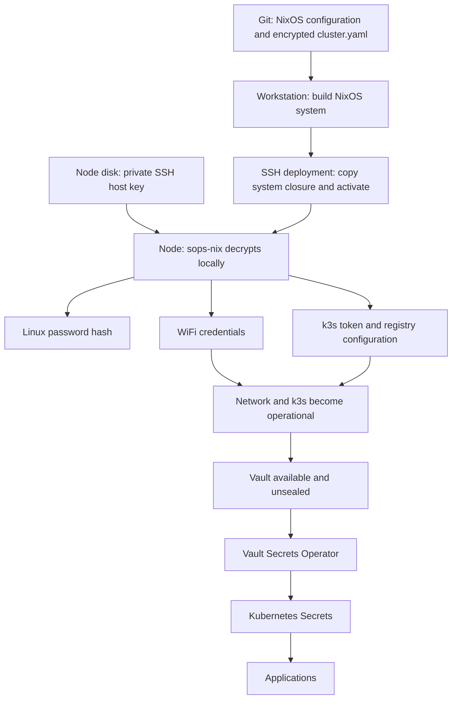
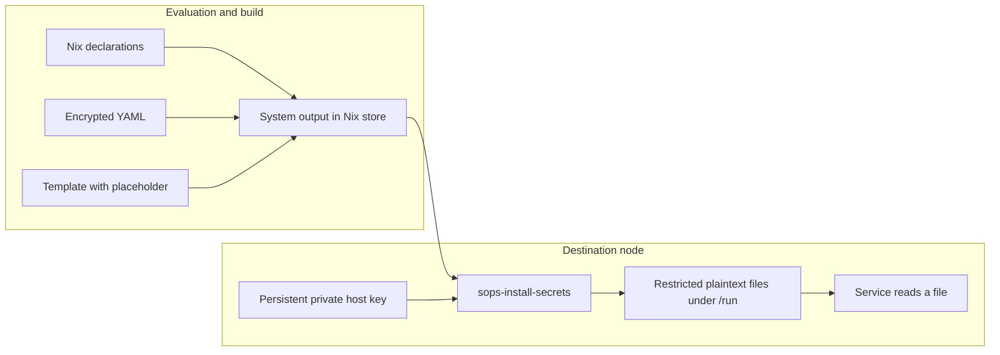
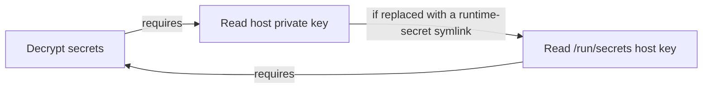
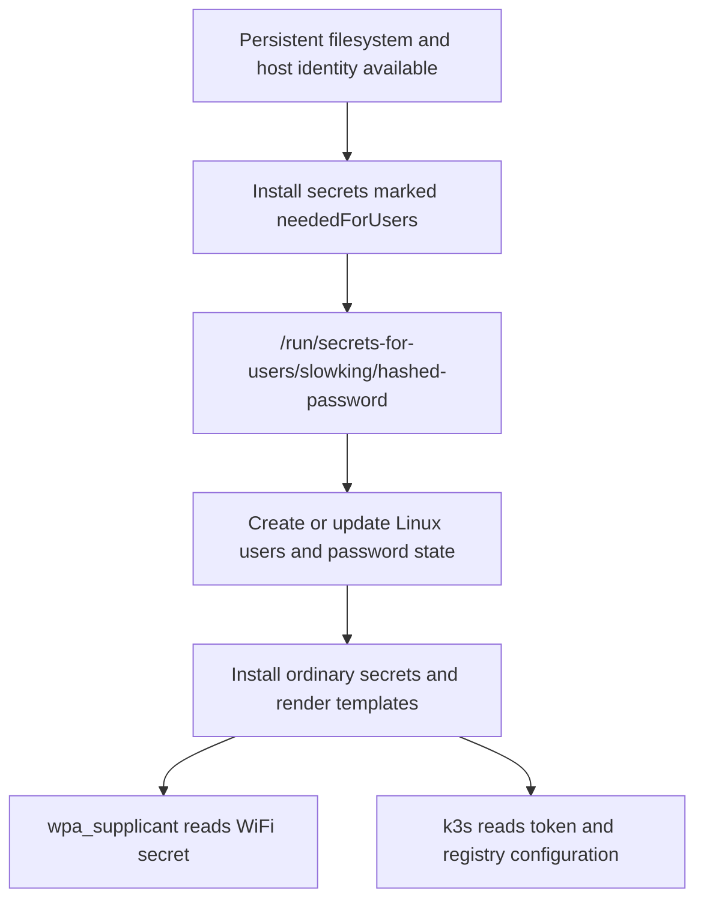
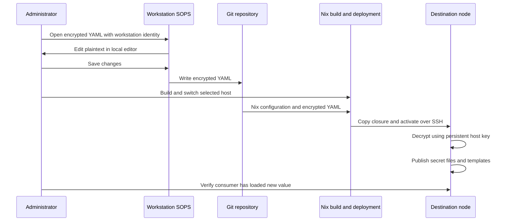
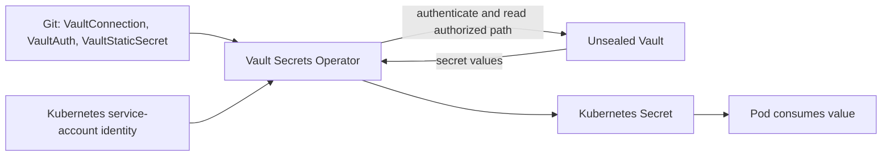

# Secrets management in this homelab

An explanation of the NixOS configuration at repository commit `0a24f97`, inspected on 2026-10-05.

This guide describes the checked-in configuration, including its important operational limits. No secrets were decrypted and no nodes were changed to prepare it. The running systems were not inspected, so a configured setting is not proof that the latest generation has been deployed.

## 1. The overall design

Your homelab uses two systems for two stages of its lifecycle:

| Stage | System | What it supplies |
|---|---|---|
| Starting and configuring the machines | SOPS, age, and sops-nix | WiFi credentials, k3s token, Linux password hash, registry password |
| Running applications inside Kubernetes | Vault and Vault Secrets Operator | Application credentials synchronized into Kubernetes Secrets |

The NixOS machines can decrypt their operating-system secrets locally. They do not need a working Kubernetes API, a running Vault, or network access to perform that decryption. This is essential because WiFi and k3s themselves need those secrets before the cluster can work.



This diagram shows dependencies, not a promise that every application starts in a strict serial order. Vault still needs its own storage, recovery material, and unsealing process. SOPS does not replace those.

The machines defined in [flake.nix](flake.nix) are:

| NixOS configuration | Address | Kubernetes role | Kubernetes node name |
|---|---|---|---|
| `cachyos` | `192.168.1.31` | Server / control plane | `cachyos` |
| `tux` | `192.168.1.25` | Agent / worker | `registry.gentoo.lan` |

Both import the same secret declarations and decrypt the same shared encrypted file.

## 2. What each component does

**SOPS** is the encrypted-file editor and file format. You use its CLI on your workstation to edit secret values. The committed YAML retains readable field names while its values are encrypted. This lets Git track the configuration without holding readable passwords.

**age** provides the recipient encryption used here. An age recipient is a public string beginning with `age1…`. It can be shared and committed. The corresponding private identity can decrypt material encrypted for that recipient. Knowing the public recipient does not let someone calculate the private identity.

**sops-nix** integrates SOPS files with NixOS. You declare which values a machine needs, where to expose them, and who may read them. Its installer decrypts them on the destination machine during system activation / startup. Applications receive ordinary files; they do not need to understand SOPS. See the [upstream sops-nix overview](https://github.com/Mic92/sops-nix).

**Nix** builds the system configuration and software. For this setup, evaluation and building use ciphertext and references to future runtime files. They do not need the decrypted secret values.

**SSH** has two separate roles: carrying deployments to a node, and providing the node's persistent private host key from which its age identity is derived. These use different keys.

## 3. The files that define the system

| File | Responsibility |
|---|---|
| [flake.nix](flake.nix) | Imports the upstream sops-nix module and local modules for both hosts |
| [flake.lock](flake.lock) | Pins the actual Nixpkgs and sops-nix revisions |
| [.sops.yaml](.sops.yaml) | Defines which public recipients should receive access to each encrypted file |
| [secrets/cluster.yaml](secrets/cluster.yaml) | Holds the four encrypted node-secret values |
| [modules/sops.nix](modules/sops.nix) | Selects the encrypted file, host-key identity, permissions, and early user secret |
| [modules/common.nix](modules/common.nix) | Connects the password hash to the Linux user and defines deployment access |
| [modules/networking.nix](modules/networking.nix) | Connects the WiFi secret to wpa_supplicant |
| [modules/k3s-server.nix](modules/k3s-server.nix) | Connects the token to the server |
| [modules/k3s-agent.nix](modules/k3s-agent.nix) | Connects the same token to the agent |
| [modules/k3s-common.nix](modules/k3s-common.nix) | Renders registry authentication using a runtime template |
| [secrets/hosts/cachyos.yaml](secrets/hosts/cachyos.yaml), [secrets/hosts/tux.yaml](secrets/hosts/tux.yaml) | Contain encrypted SSH host-key fields; currently not consumed by any NixOS module |
| [.gitignore](.gitignore) | Excludes named private-key files and installation staging files |

The flake selects `nixos-26.05`; its lock pins sops-nix to `f1406619a3884cd5c47992a70b8b35c9c0fcb4c9`. Some prose in the repository still refers to running 25.11 systems or unfinished first-install work. Use the Nix files to understand desired configuration and inspect the node to establish its actual deployed version. `system.stateVersion = "25.11"` is a compatibility setting, not the installed NixOS release.

## 4. The three kinds of private key

| Key | Documented location | Purpose |
|---|---|---|
| Workstation age identity | `~/.config/sops/age/keys.txt` | Lets the administrator decrypt and edit SOPS files |
| Deployment SSH private key | `~/.ssh/gentoo_deploy_ed25519` | Authenticates the workstation as the node's `deploy` user |
| Each node's SSH host private key | `/etc/ssh/ssh_host_ed25519_key` on that node | Identifies its SSH server and supplies its SOPS age identity |

The public deployment key is committed as [keys/deploy.pub](keys/deploy.pub). It is installed into the `deploy` user's authorized keys. This is independent of the age recipients in `.sops.yaml`.

The workstation's age key normally stays on the workstation. Each node uses its own host key; the workstation key does not have to be copied to the nodes. Similarly, an ordinary NixOS build and remote activation do not intrinsically require the workstation age identity: building needs ciphertext, deployment needs SSH access, and runtime decryption uses the destination's identity. The age identity is needed when the workstation edits or decrypts secrets.

There is an indirect connection between deployment and secret access: `deploy` has unrestricted passwordless sudo. Anyone holding a working deployment key therefore has a practical route to root access and to the node's secrets, even though that key is not itself a configured SOPS recipient.

### How the SSH host key becomes an age identity

The local module contains:

```nix
sops.age.sshKeyPaths = [ "/etc/ssh/ssh_host_ed25519_key" ];
```

sops-nix supports converting Ed25519 SSH key material into an age identity. The matching public age recipient is placed in `.sops.yaml` and in the encrypted file's metadata. Conversion is deterministic: the same host key produces the same age identity. Generating a replacement SSH host key produces a different identity and does not automatically grant access to old ciphertext.

The node reads this file locally. It does not make an SSH connection to decrypt its secrets, and the SSH daemon need not be accepting connections first. The host key's permissions and persistence are what matter. The conversion capability is documented in [sops-nix's supported encryption methods](https://github.com/Mic92/sops-nix#supported-encryption-methods).

## 5. Who can decrypt which file?

The configuration uses three public recipients, named by YAML anchors: `ws`, `cachyos`, and `tux`.

| Encrypted file | Workstation | cachyos | tux |
|---|---:|---:|---:|
| `secrets/cluster.yaml` | Yes | Yes | Yes |
| `secrets/hosts/cachyos.yaml` | Yes | Yes | No |
| `secrets/hosts/tux.yaml` | Yes | No | Yes |

I checked both the creation rules and the recipient metadata stored in these encrypted files; their recipient sets agree.

Each rule has one key group containing the listed age recipients. In this arrangement, **any one matching private identity is enough**. You do not need the workstation and both machines online to decrypt `cluster.yaml`.

Access is at encrypted-file granularity. A node authorized for `cluster.yaml` can decrypt the whole file, even if its NixOS configuration declares only a subset of the values. Individual `sops.secrets` declarations decide which files sops-nix installs; they do not create cryptographic isolation within the source file.

The `.sops.yaml` rules describe what recipients SOPS should use when creating files or updating their recipient sets. Existing ciphertext carries its own recipient metadata. Merely editing `.sops.yaml` does not modify existing encrypted files or revoke access to their old copies.

### What encryption looks like

Conceptually, a SOPS file has a random data key that encrypts its values. Recipient encryption protects access to that data key. The file contains encrypted values and the recipient information required for an authorized identity to recover them. SOPS also protects document integrity. Field names, structure, and recipient identities remain visible; the whole YAML file is not an opaque blob.

For illustration, the structure here is:

```yaml
k3s:
  token: ENC[...]
wifi:
  env: ENC[...]
slowking:
  hashed-password: ENC[...]
registry:
  password: ENC[...]
sops:
  age:
    # Public recipients and encrypted key material
  # Integrity and format metadata
```

These are illustrative placeholders, not usable encrypted values. See the [SOPS documentation](https://getsops.io/docs/) for the file format and encryption model.

## 6. Why secrets do not go into the Nix store

Nix builds immutable outputs in `/nix/store`, where files are generally readable by local users and may be copied to builders or caches. A password written directly into a Nix string can become part of such an output.

This repository instead builds with:

- The encrypted `cluster.yaml`.
- A manifest describing which entries to extract and their permissions.
- Runtime path strings such as `/run/secrets/k3s/token`.
- Template text containing harmless placeholder markers.

The private host identity remains outside those build outputs. Decryption occurs on the node, and plaintext is installed under `/run`.



For example, this expression evaluates to a filename:

```nix
config.sops.secrets."k3s/token".path
```

It does not evaluate to the token. Do not replace it with `builtins.readFile` of a decrypted file. Ordinary `environment.etc.<name>.text` or `pkgs.writeText` containing a real password would also risk embedding plaintext in the store.

“Outside the Nix store” does not mean “never exists in plaintext.” Services need the values to use them. The design controls where decryption occurs and who can read the resulting files. Consumers can also copy credentials into their own persistent state.

## 7. Installation: establishing the first trust anchor

Before the first boot, the machine needs a private key that already matches a recipient of `cluster.yaml`.

The documented installation process stages an existing host key from the workstation:

```text
nixos/keys/<host>_ssh_host_ed25519_key
                     |
                     | install with mode 0600
                     v
nixos/install-extra/<host>/etc/ssh/ssh_host_ed25519_key
                     |
                     | nixos-anywhere --extra-files
                     v
Installed node: /etc/ssh/ssh_host_ed25519_key
```

Both the private-key filenames and `install-extra/` are ignored by Git. This avoids accidental normal staging, but `.gitignore` neither encrypts those files nor prevents someone from force-adding them.

The disk layouts in [cachyos/disko.nix](hosts/cachyos/disko.nix) and [tux/disko.nix](hosts/tux/disko.nix) declare persistent XFS root filesystems. They do not declare a LUKS layer. The host private key is therefore a persistent secret on the node's disk; SOPS encryption in Git is not full-disk encryption.

On first boot, the preseeded identity unlocks the node secrets, including WiFi. That solves installed-system bootstrap. Getting the temporary installer itself onto WiFi is a separate problem. [README.md](README.md) discusses a custom WiFi-capable installer and still contains migration TODOs, so its install commands should not be treated as a freshly verified reinstall runbook.

### Why the host key must not itself be a runtime SOPS secret

The warning in `modules/sops.nix` is central to the design:



At a fresh boot, runtime secret files do not yet exist. If the only host key were a symlink into that directory, decrypting it would require already having decrypted it. Keep `/etc/ssh/ssh_host_ed25519_key` as an independently provisioned persistent file.

The two `secrets/hosts/*.yaml` files each contain an encrypted `ssh_host_ed25519_key` field. No current module references those files. They can serve as recovery copies if their contents match the intended keys, but that match was not verified here. The workstation recipient can potentially recover them; the host's own recipient alone cannot rescue a lost host key because that would require the missing key. Their existence does not mean sops-nix automatically restores the host identity.

## 8. Boot and activation: when plaintext appears

The configured password hash needs to exist before Linux user management runs. Other secrets can be installed after users and groups exist, allowing their ownership to be assigned correctly.



The pinned sops-nix implementation supports activation scripts and, with supported user-management backends, systemd services. Its early-user installer runs before user setup; its ordinary installer runs after users/groups. The exact backend should be checked in an evaluated or running generation rather than assuming a `sops-nix.service` exists. See the pinned [main module](https://github.com/Mic92/sops-nix/blob/f1406619a3884cd5c47992a70b8b35c9c0fcb4c9/modules/sops/default.nix) and [user-secret module](https://github.com/Mic92/sops-nix/blob/f1406619a3884cd5c47992a70b8b35c9c0fcb4c9/modules/sops/secrets-for-users/default.nix).

The ordinary stable paths are under `/run/secrets`; user-setup paths are under `/run/secrets-for-users`. sops-nix manages generation directories behind those paths and switches to new contents atomically. Its pinned default is RAM-backed `ramfs` secret storage (`useTmpfs = false`), not persistent storage in the Nix store. A fresh boot regenerates the files using the persistent identity and encrypted source.

Atomic publication prevents readers from opening partially rewritten files. It does not make a running process forget a previously loaded credential or close an already-open file. Applications may require a reload or restart.

## 9. Every configured secret and its consumer

| SOPS entry | Runtime path | Expected owner/group and mode | Consumer |
|---|---|---|---|
| `k3s/token` | `/run/secrets/k3s/token` | root:root, `0400` | k3s server and agent |
| `wifi/env` | `/run/secrets/wifi/env` | root:wpa_supplicant, `0440` when that group exists; otherwise root:root | wpa_supplicant |
| `slowking/hashed-password` | `/run/secrets-for-users/slowking/hashed-password` | root:root, `0400` | NixOS user management |
| `registry/password` | `/run/secrets/registry/password` | root:root, `0400` | sops-nix template renderer |
| Rendered `registries.yaml` | `/run/secrets/rendered/registries.yaml` | root:root, `0400` | k3s through `/etc/rancher/k3s/registries.yaml` |

Modes `0400` and `0440` mean owner-read-only, and owner-plus-group-read-only respectively. Root can still administer these files. Defaults and template paths were checked against the pinned upstream modules, including the [template module](https://github.com/Mic92/sops-nix/blob/f1406619a3884cd5c47992a70b8b35c9c0fcb4c9/modules/sops/templates/default.nix).

### The k3s token

Both role modules set:

```nix
services.k3s.tokenFile = config.sops.secrets."k3s/token".path;
```

The agent also knows the server address, `https://192.168.1.31:6443`. The token supplies the configured shared credential used by k3s. It is separate from SSH credentials and from Kubernetes datastore encryption keys.

Rotating this value is a cluster operation, not just a text edit. Existing k3s state and the server/agent transition must remain consistent. This guide intentionally does not present changing the YAML value as a complete token-rotation procedure.

### The WiFi environment file

The network module points `networking.wireless.secretsFile` at the runtime secret and uses:

```nix
pskRaw = "ext:WIFI_PSK";
```

The encrypted `wifi/env` value must supply the expected `WIFI_PSK` entry in the format consumed by the wireless module. The SSID is read separately from the committed `assets/wifi-ssid.txt`; it is not encrypted by this setup. The actual PSK and its stored representation were not inspected.

The local module explains its explicit `0440` permission: the newer wpa_supplicant service runs as an unprivileged account, so a root-only secret would prevent it from reading the credentials even if the file is visible inside its service sandbox. The conditional group assignment also supports configurations without a `wpa_supplicant` group.

These nodes are WiFi-only. A failed WiFi credential change can remove the remote path needed to fix it, so a rotation needs router coordination and a recovery route.

### The slowking password hash

The secret declaration sets `neededForUsers = true`, and the user declaration sets:

```nix
users.mutableUsers = false;
users.users.slowking.hashedPasswordFile =
  config.sops.secrets."slowking/hashed-password".path;
```

The secret is an encrypted **password hash**, rather than the login password itself. At activation, NixOS uses that hash to establish the account's password state. Hashes remain sensitive because they can be attacked offline.

`mutableUsers = false` makes declarative configuration authoritative. A manual password change is not the durable way to update this account; a later activation can restore the configured hash. The resulting account password state also lives in the system's shadow-password database, so the runtime secret file is not its only manifestation.

SSH password and keyboard-interactive authentication are disabled in [modules/security.nix](modules/security.nix). This password is used for local login / interactive sudo, while SSH access uses authorized keys. `deploy` has its own passwordless sudo rule.

### The registry password and runtime template

The registry password is combined with nonsecret YAML at runtime:

```nix
sops.templates."registries.yaml".content = ''
  # ... mirrors and registry name ...
  auth:
    username: registry-admin
    password: ${config.sops.placeholder."registry/password"}
'';
```

This is an excerpt illustrating substitution, not a standalone replacement for the full configuration.

During evaluation, `sops.placeholder` produces a marker. During secret installation, sops-nix replaces that marker with the decrypted password and writes the complete runtime file. `environment.etc` connects `/etc/rancher/k3s/registries.yaml` to that runtime path. The store may contain template text and symlinks pointing toward runtime paths; it does not need to contain the rendered password.

K3s reads this registry configuration at startup to generate containerd configuration. A registry change therefore needs a k3s restart on each affected node. The current template and secret declarations do not specify `restartUnits`, so a password-only edit must not be assumed to cause a restart. Other unit changes during the same rebuild might cause one. A possible future explicit hook is `sops.templates."registries.yaml".restartUnits = [ "k3s.service" ];`, after confirming the unit name in the deployed generation. No such change was made for this guide. See [K3s private-registry documentation](https://docs.k3s.io/installation/private-registry).

The checked-in mirror endpoint is explicitly `http://registry.gentoo.lan`. The same file also specifies a CA certificate. A CA setting does not turn an HTTP endpoint into HTTPS; its presence alone is not proof that the configured mirror connection encrypts credentials in transit. Actual redirects or fallback behavior require runtime inspection.

The CA certificate is public trust material committed at `assets/gentoo-internal-ca.crt`. It is not the CA private key. Repository operations notes say this pinned copy must stay consistent with the cluster's internal CA.

## 10. Editing and deploying a change

The normal flow is:



Commands in this section are examples for your terminal; none were executed while writing the guide.

From the repository root, edit using the workstation identity:

```bash
cd nixos
SOPS_AGE_KEY_FILE="$HOME/.config/sops/age/keys.txt" \
  sops secrets/cluster.yaml
```

SOPS temporarily presents readable values to the editor and writes encrypted content back. Treat editor swap files, backups, clipboard history, and terminal output as possible plaintext copies. Avoid writing decrypted YAML into the checkout.

Review the encrypted diff and associated Nix declarations. If adding new files, stage those specific files before building: Git-backed flakes do not normally include untracked source files. Existing tracked edits are visible to a local flake build even before committing.

Build each affected host:

```bash
nix build .#nixosConfigurations.cachyos.config.system.build.toplevel --no-link
nix build .#nixosConfigurations.tux.config.system.build.toplevel --no-link
```

A successful build checks configuration/build consistency. It does not prove that the installed host key matches a recipient, that the service will accept the credential, or that a running process has reloaded it.

Deploy one node at a time using the deployment identity and normal SSH host-key verification:

```bash
NIX_SSHOPTS="-i $HOME/.ssh/gentoo_deploy_ed25519" \
  nixos-rebuild switch --flake .#cachyos \
  --target-host deploy@192.168.1.31 --use-remote-sudo

NIX_SSHOPTS="-i $HOME/.ssh/gentoo_deploy_ed25519" \
  nixos-rebuild switch --flake .#tux \
  --target-host deploy@192.168.1.25 --use-remote-sudo
```

Use the equivalent option supported by your installed rebuild tool if its remote-sudo interface differs. Verify each host and coordinate reloads/restarts required by the changed credential.

**Committing or pushing `nixos/` does not deploy it.** This flake is outside Argo CD's application reconciliation path. OS changes need deliberate NixOS deployment. Application manifests elsewhere in the repository have a different, automated GitOps lifecycle.

## 11. Adding a secret or a node

### A new secret for an existing service

1. Decide who should have decryption access. A value added to `cluster.yaml` is available to both nodes and the workstation.
2. Add the value through SOPS, preserving encrypted storage.
3. Declare it, for example `sops.secrets."example/api-token" = { };`.
4. Connect the service to `config.sops.secrets."example/api-token".path`, or use a runtime template when a configuration file needs the actual value.
5. Give only the consuming account/group the required access. Root-only defaults may be insufficient for an unprivileged daemon.
6. Arrange consumer ordering and any required restart/reload behavior.
7. Build, deploy, and verify functionality without printing the credential.

Adding an encrypted field by itself does not install a runtime file. Declaring a file without connecting it to a service does not make the service use it. For a value that should belong to only one node, create an appropriately scoped encrypted file and set that declaration's `sopsFile` accordingly.

### A new node

The new node needs a unique persistent SSH host key, its derived public age recipient in the relevant creation rules, and updated encrypted file metadata granting that recipient access. From `nixos/`, the existing runbook uses:

```bash
SOPS_AGE_KEY_FILE="$HOME/.config/sops/age/keys.txt" \
  sops updatekeys secrets/cluster.yaml
```

`updatekeys` applies recipient changes to the existing encrypted file. Review its proposed change. Then add the node's NixOS configuration, build it, and provision the matching private key through the installation process before its first boot.

Creating a `secrets/hosts/<new>.yaml` recovery copy is separate from provisioning that key. Existing nodes do not suddenly need the new node's private key; each retains its own access to the shared file.

## 12. Rotation, removal, and rollback

“Rotate the secret” can mean several different operations:

| Operation | What changes | What it does not do automatically |
|---|---|---|
| Edit a password/token through SOPS | The application credential inside the encrypted file | Update the remote service or make processes reload it |
| Edit recipients and run `sops updatekeys` | Which identities receive access in that file's current metadata | Erase access to old ciphertext or replace leaked credentials |
| Rotate the SOPS data key | The encryption key protecting the file's values | Change those values in the service that accepts them |
| Replace a host SSH key | SSH server identity and derived age identity | Grant the new identity access to existing files |
| Rotate Kubernetes datastore encryption keys | Encryption of Kubernetes data at rest | Rotate SOPS recipients or the registry password |

For the login password, the existing README provides an interactive `mkpasswd` workflow. Its essential sequence is: generate a hash locally, place the hash in SOPS, deploy both nodes, and verify login/sudo behavior. The cleartext password need not appear in Nix or Git.

Registry rotation spans systems: the node-side `registry/password` must agree with the credentials accepted by Zot. Repository notes link this to the `zot-auth` Kubernetes Secret; its Vault synchronization reads `secret` mount / `zot/auth` path. No mechanism in the NixOS modules synchronizes the SOPS value from Vault. Coordinate both sides and restart consumers.

Removing a recipient cannot revoke knowledge already obtained. Git history, old system generations, downloaded ciphertext, and backups may retain versions encrypted for the removed key. After a compromise, replace the underlying credentials as well as updating recipients and encryption material.

A NixOS rollback can bring back an older encrypted secret version. That may be useful after a bad local change, but it cannot roll back an external router password or a registry credential by itself. Old ciphertext also still requires an identity authorized to decrypt it.

The repository's `CLAUDE.md` records a previous destructive Kubernetes encryption-key rotation incident and explicitly says not to run the k3s rotation commands here. That is separate from ordinary SOPS maintenance; do not use datastore-key rotation as a fix for a SOPS decryption failure.

## 13. Recovery and troubleshooting

The recovery foundation is an independently accessible private identity. A clone of the repository alone is not enough to decrypt it.

Keep recoverable copies of the workstation age identity and each node's intended persistent identity, along with the information needed to restore the cluster's separate Vault and storage systems. An encrypted host-key backup whose only surviving recipient is the missing host key cannot unlock itself.

| Symptom | Likely explanation | First useful check |
|---|---|---|
| All SOPS values fail after reinstall | New/missing host key does not match file recipients | Confirm the correct persistent identity was provisioned |
| Failure after replacing the host key with a symlink | Decryption depends on its own missing output | Inspect the host-key path and restore an independent real key |
| Secret exists but WiFi cannot read it | Group, file mode, or service sandbox access mismatch | Inspect `wifi/env` metadata and wireless logs |
| Registry pulls return 401 | Wrong/mismatched password or k3s still using old configuration | Confirm both sides were updated and k3s restarted |
| Registry pulls fail with certificate errors | CA or certificate mismatch | Compare the deployed public CA with the issuer used by the endpoint |
| Password hash does not apply | Early-user secret failure or undeployed generation | Check early activation and the evaluated hash-file path |
| A new secret is missing | Missing declaration, missing Git-tracked source, or no deployment | Trace source field → declaration → generation → runtime path |
| SOPS CLI cannot decrypt on workstation | Wrong/missing workstation identity | Check identity selection and encrypted-file recipients |
| Build succeeds, activation fails | Runtime key access or consumer constraints differ from build assumptions | Inspect activation output on the destination |

On a node, metadata inspection can establish a lot without printing values:

```bash
# Run with appropriate root privileges on the target node.
sudo stat /etc/ssh/ssh_host_ed25519_key
sudo test ! -L /etc/ssh/ssh_host_ed25519_key
sudo stat -L /run/secrets/k3s/token /run/secrets/wifi/env
sudo stat -L /run/secrets-for-users/slowking/hashed-password
sudo stat -L /run/secrets/rendered/registries.yaml
readlink -f /etc/rancher/k3s/registries.yaml
systemctl list-units --all 'sops*' 'wpa_supplicant*' 'k3s*'
```

The `test` command signals success/failure through its exit status rather than printing a message. Inspect the actual discovered units' logs or rebuild activation output; an activation-script installation may have no dedicated SOPS service. Logs should still be reviewed before sharing because consumers can accidentally log sensitive data.

For recovery from a missing host key, restore the intended key from a verified independent backup using a local console or rescue route. Alternatively, authorize a new identity by updating and deploying the encrypted files before expecting it to decrypt them. Do not delete or regenerate keys as an exploratory troubleshooting step.

## 14. How Vault fits after NixOS has booted

The application-secret configuration lives in [apps/secrets/vault-sync](../apps/secrets/vault-sync/):

- `VaultConnection` supplies Vault's HTTPS address, CA reference, and server name.
- `VaultAuth` selects Kubernetes authentication and maps a service account to a Vault role.
- `VaultStaticSecret` selects a Vault mount/path and destination Kubernetes Secret, with refresh settings and sometimes transformations.



These manifests describe how to fetch application credentials. They do not make `nixos/secrets/cluster.yaml` a Vault-backed file. There is no configured SOPS/Vault encryption backend in `.sops.yaml`; this setup uses age recipients.

The k3s server configuration additionally enables `--secrets-encryption`. This concerns Kubernetes Secrets in its datastore. SOPS protects the committed node-secret file; Vault holds application secret values; datastore encryption protects another storage location. None of those mechanisms makes a running application unable to see a credential that it needs, and Kubernetes access permissions still matter.

## 15. What the design protects, and its concrete limits

The design allows the repository and ordinary Nix build outputs to carry the node configuration without including readable node-secret values. It also lets the machines recover their runtime secret files after reboot without contacting a secret server.

Its boundaries follow directly from the configuration:

| Boundary | Implication |
|---|---|
| Both nodes decrypt all of `cluster.yaml` | Compromising either host identity exposes every shared value in that file |
| Root and `deploy` have broad machine access | Runtime file permissions do not protect against a root-level compromise |
| Persistent host key on declared XFS root without LUKS | SOPS does not protect that identity against someone who can read the disk |
| Private recovery files ignored by Git | Those local files still require secure storage and backup |
| Runtime secret paths contain plaintext | Consumers and privileged processes can read it |
| Registry mirror explicitly uses HTTP | Encrypted Git storage does not establish transport confidentiality |
| No explicit secret/template restart hooks here | New file contents do not guarantee new credentials are active in a daemon |
| Manual NixOS deployments | Git state and node state can differ until a rebuild is applied |

Another consequential setting is the server's `--write-kubeconfig-mode=0644`. The repository deliberately permits local unprivileged use of the server kubeconfig. That file contains cluster access credentials and therefore forms an additional local access boundary; it is not one of the four SOPS-managed values.

The durable dependency chain is: **independently provisioned host identity → local secret decryption → Linux users, WiFi, and k3s → Vault and application secret delivery**. Every install, rotation, and recovery procedure needs to preserve that chain.
